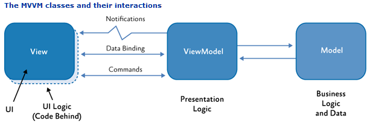
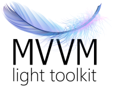
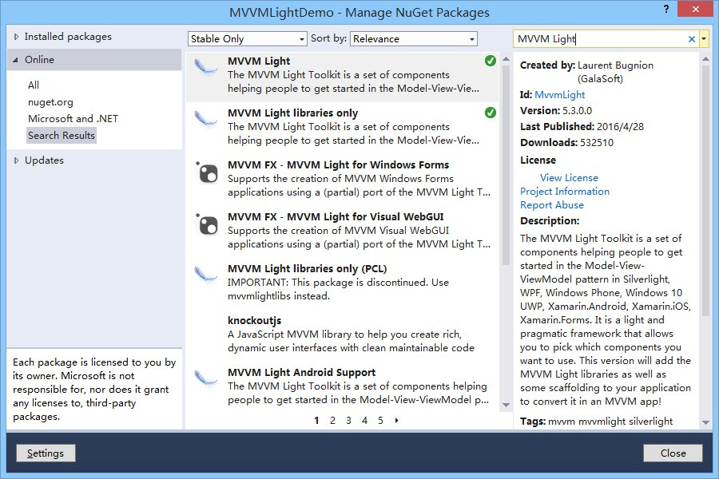
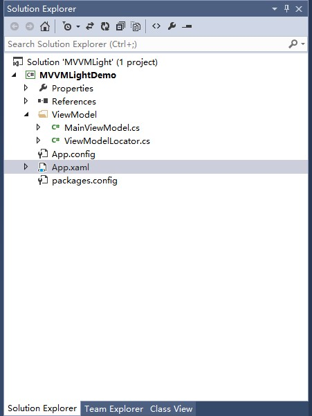

# 1 mvvmlight介绍以及在项目中的使用

**一、MVVM 和 MVVMLight介绍**

MVVM是Model-View-ViewModel的简写。类似于目前比较流行的MVC、MVP设计模式，主要的目的是为了分离视图（View）和模型（Model）之间的耦合。

它是一种极度优秀的设计模式，但并非是框架级别的东西，由MVP（Model-View-Presenter）模式与WPF结合的应用方式发展演变过来的一种新型架构。

立足于原有MVP框架并且把WPF的新特性糅合进去，以应对PC端开发日益复杂的需求变化。

结构如图所示:

相对于之前把逻辑结构写在Code Behind 里面的方式，MVVM几乎完全解耦了视图和逻辑业务之间的关系，通过数据绑定和命令来处理UI属性及事件驱动。同理，ViewModel的视图交互业务逻辑处理导致的属性变更也会通知到View前端，让View前端实时更新。Model中存放数据模型、数据逻辑和业务逻辑。

其实，我个人认为，数据和业务交互这一层还是应该另外独立的，Model中应该完全就是实体模型，这样就更清晰了。

这种类型的双向绑定非常的优秀，View的变动，会自动反应到ViewModel上，反之亦然。目前JS前端框架AngularJS也是采用这种设计模式。

MVVM模式和MVC模式一样，主要目的是分离视图（View）和模型（Model），它具有以下几大优点：

1. **低耦合**：视图（View）可以独立于 Model 变化和修改，一个 ViewModel 可以绑定到不同的View 上，当 View 变化的时候，Model 可以不变，当Model变化的时候，View也可以不变。
2. **可重用性**：可以把一些视图逻辑放在一个ViewModel里面，让很多View重用这段视图逻辑。
3. **独立开发**：开发人员可以专注于业务逻辑和数据的开发（ViewModel），设计人员可以专注于页面设计，使用Expression Blend可以很容易设计界面并生成xml代码。
4. **可测试**：界面素来是比较难于测试的，而现在测试可以针对ViewModel来写。

希望对MVVM有更进一步了解的同学可以看看这篇文章： [https://www.codeproject.com/kb/wpf/wpfmvvmquickstart.aspx](https://www.codeproject.com/kb/wpf/wpfmvvmquickstart.aspx) ，作者从MVVM的模式介绍到数据绑定、消息通知、命令等几个主要方面，每方面都有详细的说明。

如果你目前正在进行微软的 WPF 、Windows Phone、Windows 8、SilverLight相关项目的开发，我想你很有必要了解一下 mvvmlight 框架。它轻量（相对于Prism），专注（仅负责MVVM架构模式的实现，没有其它多余的组件），高效（使用简易，省时减力），能够帮助你更好的开发你的应用。

MVVMLight的作者Laurent Bugnion 是个微软MVP，这个是MVVMLight的官网：[http://www.mvvmlight.net/](http://www.mvvmlight.net/)，上面有详细的介绍和视频文档，同时作者还将代码开源到 Codeplex上面：[http://mvvmlight.codeplex.com/](http://mvvmlight.codeplex.com/)，有兴趣的同学可以下载来了解下。

有趣的是，MVVMLight的产品Logo是一根羽毛，寓意了我们上面提到的优点：轻量、专业、高效，不知道作者是不是这个意思。

**二、如何在你的WPF应用中使用MVVMLight**

目前，主要有两种使用方式：

一种是去官网上下载MVVMLight Toolkit，安装之后，VS模板中会出现MvvmLight项目模板，你可以直接使用该项目模板来创建项目了。

里面会包含默认的ViewModelLocator和MainViewModel，MainViewModel就是你Main视图的ViewModel了，而ViewModelLocator是一个全局的ViewModel加载注册器，这个第二篇会详细说到。

另一种方式就是去NuGet上安装，这无疑是最便捷的事了。在NuGet 工具箱上搜索 MVVM Light，可以看到两个项目，一个是MVVM Light ， 一个是 MVVM Light libraries only。

当前版本是5.3，说明MVVM Light的更新速度还是挺快的，Prerelease中还有 V5.4 的 Alpha 版本。

Nuget上这两个项目的区别就是MVVM Light除了必要的GalaSoft 组件之外，还会额外添加相关分层文件目录，形成简单的MVVMLight成型框架。

如图，它会帮你生成ViewModel文件夹，里面包含MainViewModel和ViewModelLocator文件。

至此，一个基于MVVMLight的WPF项目框架基本搭建完成了，下面一篇，我们将详细说下框架的结构。
