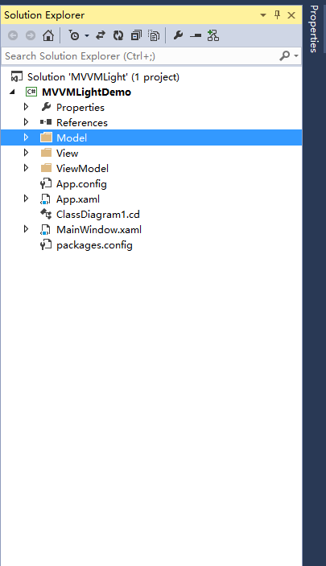
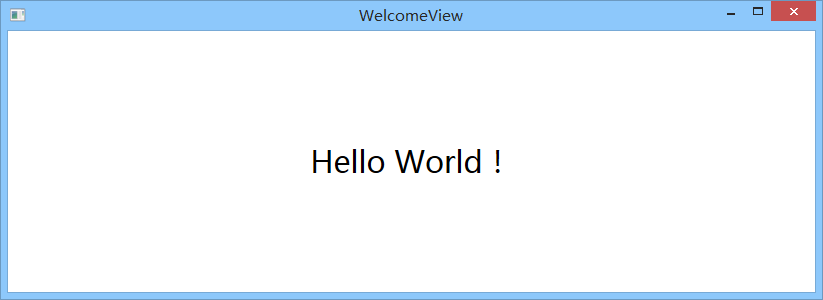
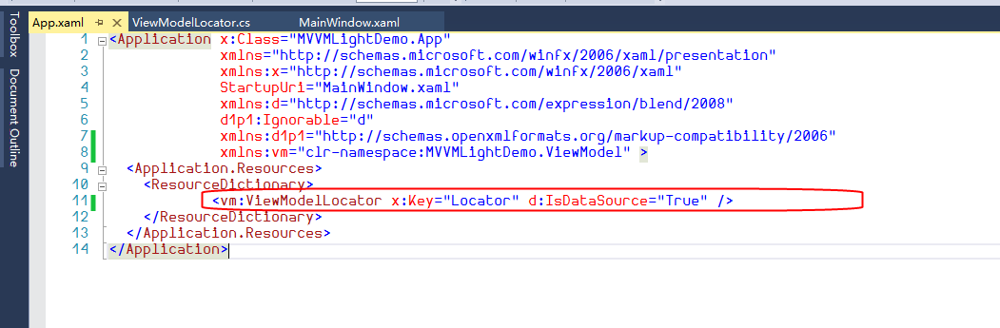
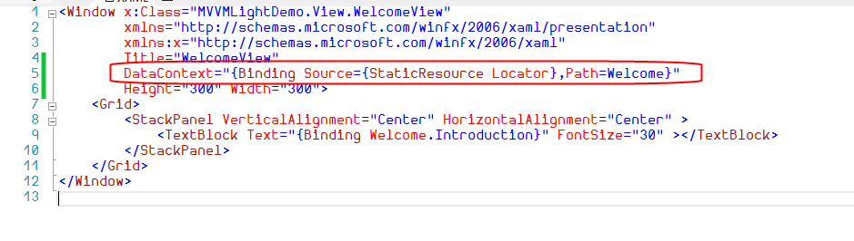
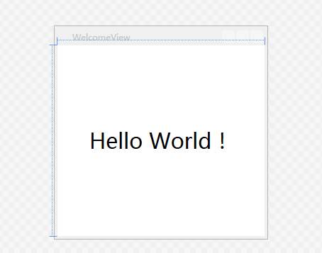
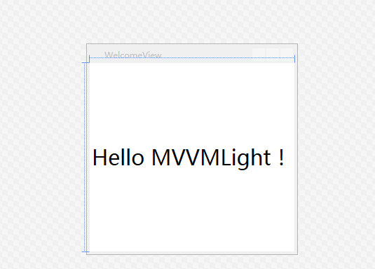

# 2 Model、View、ViewModel结构以及全局视图模型注入器的说明

在上一篇中，我们已经介绍了如何使用NuGet把MVVMLight应用到我们的WPF项目中。在这一篇，我们来了解下一个基本的MVVMLight框架所必须的结构以及运行模式。

mvvmlight安装之后，我们可以看到简易的框架布局，如上篇所示，项目中生成了一个ViewModel文件夹，ViewModel层的内容都放在这里，除了Main对象的ViewModel之外，还包含一个ViewModelLocator文件，用来注入当前的ViewModel全局实例。

**一、先来说说分层结构：**


1. View，负责前端展示，与ViewModel进行数据、命令的交互。
2. ViewModel，负责前端视图业务级别的逻辑结构组织，并将其反馈给前端。
3. Model，主要负责数据实体的结构处理，与ViewModel进行交互。

根据上述的分层，我们来进行编码。

先建立一个完整的三层结构目录，如图所示，包含View、ViewModel、Model 三层文件夹：



**1、写一个Model，代码如下：**

```csharp
using GalaSoft.MvvmLight;
using System;
using System.Collections.Generic;
using System.Linq;
using System.Text;
using System.Threading.Tasks; 

namespace MVVMLightDemo.Model
{
    public class WelcomeModel : ObservableObject
    {
        private String introduction;

        /// <summary>
        /// 欢迎词
        /// </summary>
        public String Introduction
        {
            get { return introduction; }
            set
            {
                introduction = value;
                RaisePropertyChanged(()=>Introduction);
            }
        }
    }
}
```

很简单，仅仅是包含一个实体对象，这边需要注意的是，它继承了一个父类：ObservableObject ，这个父类的作用就是保证能够检测属性是否被改变。它实现了INotifyPropertyChanged接口，通过触发PropertyChanged事件达到通知UI更改的目的；

所以，我们在定义实体对象的时候，只需要调用RaisePropertyChanged(PropertyName)就可以进行属性更改通知了。

所以，实体里面定义的每个属性都加上RaisePropertyChanged(PropertyName)的调用，就可以实现对UI的交互更新了。

**2、写一个VideModel，来负责跟View的交互。**

```csharp
using System;
using System.Collections.Generic;
using System.Linq;
using System.Text;
using System.Threading.Tasks;
using GalaSoft.MvvmLight;
using MVVMLightDemo.Model;

namespace MVVMLightDemo.ViewModel
{
    public class WelcomeViewModel:ViewModelBase
    {
        /// <summary>
        /// 构造函数
        /// </summary>
        public WelcomeViewModel()
        {
            Welcome = new WelcomeModel()
                     { Introduction = "Hello World！" };
        }

        #region 属性
        private WelcomeModel welcome;

        /// <summary>
        /// 欢迎词属性
        /// </summary>
        public WelcomeModel Welcome
        {
            get { return welcome; }
            set
            {
                welcome = value;
                RaisePropertyChanged(()=>Welcome);
            }
        }
        #endregion
    }
}
```

这个也很简单，包含了一个命名为Welcome的WelcomeModel属性，以及继承了ViewModelBase的父类，ViewModelBase 同时继承了 ObservableObject 类和 ICleanup 接口。所以，它同样具有 INotifyPropertyChanged 接口的能力，能够通过触发 PropertyChanged 事件达到通知 View 的目的；构造函数中对 Welcome 属性进行了实例化。

**3、写一个View，来显示和交互ViewModel。**

```xml
<Window x:Class="MVVMLightDemo.View.WelcomeView"
 xmlns="http://schemas.microsoft.com/winfx/2006/xaml/presentation"
 xmlns:x="http://schemas.microsoft.com/winfx/2006/xaml"
 Title="WelcomeView" Height="300" Width="300">
 <Grid>
    <StackPanel VerticalAlignment="Center" HorizontalAlignment="Center">
        <TextBlock Text="{Binding Welcome.Introduction}" FontSize="30">
        </TextBlock>  
    </StackPanel>
 </Grid>
</Window>
```

&#x20;TextBlock 绑定了 Welcome.Introduction，所以，应该显示 Welcome 对象下的 Introduction 属性。

当然，这时候的 View 与 ViewModel之间是没有任何联系的，所以，我们需要在 code-behind 的构造函数中添加如下代码：&#x20;

```csharp
using System.Windows;
using MVVMLightDemo.ViewModel;

namespace MVVMLightDemo.View
{
    /// <summary>
    /// Interaction logic for WelcomeView.xaml
    /// </summary>
    public partial class WelcomeView : Window
    {
        public WelcomeView()
        {
            InitializeComponent();
            this.DataContext = new WelcomeViewModel();
        }
    }
}
```

把 WelcomeViewModel 赋值给当前 View 视图的 DataContext 数据上下文。现在，可以在当前 View 视图中使用 ViewModel 中所有的公开属性和命令。

**执行效果如下：**



**二、再来说说构造器：**

如果使用NuGet安装的是一个完整的 MVVMLight 框架，而非 MVVMLight Libraries Only 的时候，总是会带上 ViewModelLocator 类，并且将生成的 ResourceDictionary 加入到了全局资源中。



```xml
<Application x:Class="MVVMLightDemo.App"
  xmlns="http://schemas.microsoft.com/winfx/2006/xaml/presentation"
  xmlns:x="http://schemas.microsoft.com/winfx/2006/xaml"
  StartupUri="View/WelcomeView.xaml"
  xmlns:d="http://schemas.microsoft.com/expression/blend/2008"
  d1p1:Ignorable="d"
  xmlns:d1p1="http://schemas.openxmlformats.org/markup-compatibility/2006"
  xmlns:vm="clr-namespace:MVVMLightDemo.ViewModel" >
  <Application.Resources>
    <ResourceDictionary>
      <vm:ViewModelLocator x:Key="Locator" d:IsDataSource="True" />
    </ResourceDictionary>
  </Application.Resources>
</Application>
```

所以，在每次App初始化的时候，就会去初始化 ViewModelLocator 类；同时，需要将 StartupUri 设置为指定页面 **View/WelcomeView.xaml**。

实际上，它就是一个很基本的 ViewModel 视图模型注入器。在构造器中把使用到的 ViewModel 统一进行注册，并生成单一实例。然后，使用属性把它暴露出来，每当我们访问属性的时候，就会返回相应的 ViewModel 实例。

```csharp
/*
 In App.xaml:
 <Application.Resources>
  <vm:ViewModelLocator xmlns:vm="clr-namespace:MVVMLightDemo"
                       x:Key="Locator" />
 </Application.Resources>

 In the View:
 DataContext="{Binding Source={StaticResource Locator},
 Path=ViewModelName}"

 You can also use Blend to do all this with the tool's support.
 See http://www.galasoft.ch/mvvm
*/ 
using GalaSoft.MvvmLight;
using GalaSoft.MvvmLight.Ioc;
using Microsoft.Practices.ServiceLocation;

namespace MVVMLightDemo.ViewModel
{
    /// <summary>
    /// This class contains static references to all the view models
    /// in the application and provides an entry point for the bindings.
    /// </summary>
    public class ViewModelLocator
    {
        /// <summary>
        /// Initializes a new instance of the ViewModelLocator class.
        /// </summary>
        public ViewModelLocator()
        {
            ServiceLocator.SetLocatorProvider(() => SimpleIoc.Default);

#region Code Example
            ////if (ViewModelBase.IsInDesignModeStatic)
            ////{
            //// // Create design time view services and models
            //// SimpleIoc.Default.Register<IDataService,
            //// DesignDataService>();
            ////}
            ////else
            ////{
            //// // Create run time view services and models
            //// SimpleIoc.Default.Register<IDataService, DataService>();
            ////}
#endregion

            SimpleIoc.Default.Register<MainViewModel>();  
        }

#region 实例化
        public MainViewModel Main
        {
            get
            {
                return ServiceLocator.Current
                       .GetInstance<MainViewModel>();
            }
        }
#endregion

        public static void Cleanup()
        {
            // TODO Clear the ViewModels
        }
    }
}
```

需要注意的是，这边把 MVVMLight 自带的 SimpleIoc 作为默认的服务提供者，它是个简易的注入框架。

为了统一化，并且在设计的时候就可以看到 ViewModel 的数据，这边使用 ServiceLocator 又将SimpleIoc 包裹了一层。

上面我们写了一个Hello World，这时候就可以用这种方式改装了。

```csharp
/*
 In App.xaml:
 <Application.Resources>
  <vm:ViewModelLocator xmlns:vm="clr-namespace:MVVMLightDemo"
                       x:Key="Locator" />
  </Application.Resources>

 In the View:
 DataContext="{Binding Source={StaticResource Locator},
 Path=ViewModelName}"

 You can also use Blend to do all this with the tool's support.
 See http://www.galasoft.ch/mvvm
*/
using GalaSoft.MvvmLight;
using GalaSoft.MvvmLight.Ioc;
using Microsoft.Practices.ServiceLocation;

namespace MVVMLightDemo.ViewModel
{
    /// <summary>
    /// This class contains static references to all the view models
    /// in the application and provides an entry point
    /// for the bindings.
    /// </summary>
    public class ViewModelLocator
    {
        /// <summary>
        /// Initializes a new instance of the ViewModelLocator class.
        /// </summary>
        public ViewModelLocator()
        {
            ServiceLocator.SetLocatorProvider(() => SimpleIoc.Default);
#region Code Example
            ////if (ViewModelBase.IsInDesignModeStatic)
            ////{
            //// // Create design time view services and models
            //// SimpleIoc.Default.Register<IDataService,
            //// DesignDataService>();
            ////}
            ////else
            ////{
            //// // Create run time view services and models
            //// SimpleIoc.Default.Register<IDataService, DataService>();
            ////}
#endregion

            SimpleIoc.Default.Register<MainViewModel>();
            SimpleIoc.Default.Register<WelcomeViewModel>();
        }

#region 实例化
        public MainViewModel Main
        {
            get
            {
                return ServiceLocator.Current
                       .GetInstance<MainViewModel>();
            }
        }

        public WelcomeViewModel Welcome
        {
            get
            { 
                return ServiceLocator.Current
                       .GetInstance<WelcomeViewModel>();
            }
        }
#endregion

        public static void Cleanup()
        {
            // TODO Clear the ViewModels
        }
    }
}
```

在注册完 WelcomeViewModel 实例之后，我们就可以在相应的 View 中使用了 ：

```csharp
public WelcomeView()
{
    InitializeComponent();
    this.DataContext = new WelcomeViewModel();
}
```

原本代码中的 this.DataContext = new WelcomeViewModel(); 这时可以去掉了，直接在WelcomeView 中这样写：

DataContext="{Binding Source={StaticResource Locator},Path=Welcome}"，如下图所示：



这样做的好处，一个是绑定化相对于简单粗暴的赋值方式，更合理。一个是在可视化窗口中可以看到所绑定的数据，达到所见即所得的友好效果。如下所示：



当我们改掉绑定的数据，编译之后就会立马呈现出来：



这样，服务端开发人员可以专心写 ViewModel 的业务逻辑代码，UI开发人员可以专注设计 View 视图了；同样的，ViewModel 可以绑定到不同的视图上，所以，从这边就可以体现出其中的三个重要特性：低耦合、可重用性、独立开发。

大家有没有发现 ViewModelLocator 类中还有个 ClearnUp() 方法，主要目的用于清除 ViewModel中的实例。ViewModelBase 继承了 GalaSoft.MvvmLight.ICleanup 接口，并在自己的类中写好了Cleanup() 虚方法。所以，我们在实例 ViewModel 类中可以重写 Cleanup() 来达到清除当前实例的目的。

这个在后面几篇讲解数据绑定、命令的时候将会详细介绍。
