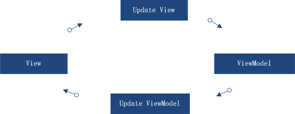
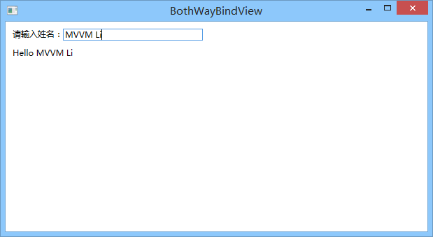

# 3 双向数据绑定

在上篇中，我们已经了解了 MVVM 框架结构和运行原理。在这里，我们来看一下伟大的双向数据绑定。说到双向数据绑定，大家比较熟悉的应该就是AngularJS了，几乎所有的AngularJS 系列教程的开篇几章都要涉及到，真的是很好用。

表现出的效果很简单：就是在界面的操作对数据模型的修改能实时反映到数据；而数据的变更能实时展现到界面。即视图数据模型（ViewModel）和视图（View）之间的双向绑定和触发。



我们来操作一个试试看：

第一步：先写一个Model，里面包含我们需要的数据信息，代码如下：

```csharp
/// <summary>
/// 用户信息
/// </summary>
public class UserInfoModel : ObservableObject
{
    private String userName;
    /// <summary>
    /// 用户名称
    /// </summary>
    public String UserName
    {
        get { return userName; }
        set { userName = value; RaisePropertyChanged(()=>UserName); }
    }

    private Int64 userPhone;
    /// <summary>
    /// 用户电话
    /// </summary>
    public Int64 UserPhone
    {
        get { return userPhone; }
        set { userPhone = value; RaisePropertyChanged(()=>UserPhone); }
    }

    private Int32 userSex;
    /// <summary>
    /// 用户性别
    /// </summary>
    public Int32 UserSex
    {
        get { return userSex; }
        set { userSex = value; RaisePropertyChanged(()=>UserSex); }
    }

    private String userAdd;
    /// <summary>
    /// 用户地址
    /// </summary>
    public String UserAdd
    {
        get { return userAdd; }
        set { userAdd = value; RaisePropertyChanged(()=>UserAdd); }
    }
}
```

第二步：写一个 ViewModel，包含了 View 所需要的命令和属性：

```csharp
public class BothWayBindViewModel:ViewModelBase
{
    public BothWayBindViewModel()
    {
        UserInfo = new UserInfoModel();
    }

#region 属性
    private UserInfoModel userInfo;
    /// <summary>
    /// 用户信息
    /// </summary>
    public UserInfoModel UserInfo
    {
        get { return userInfo; }
        set { userInfo = value; RaisePropertyChanged(()=>UserInfo); }
    }
#endregion

#region 命令
#endregion
}
```

第三步：在 ViewModelLocator 中注册我们写好的 ViewModel：SimpleIoc.Default.Register\<BothWayBindViewModel>();

```csharp
/*
 In App.xaml:
 <Application.Resources>
 <vm:ViewModelLocator xmlns:vm="clr-namespace:MVVMLightDemo"
                      x:Key="Locator" />
 </Application.Resources>

 In the View:
 DataContext="{Binding Source={StaticResource Locator},
 Path=ViewModelName}"

 You can also use Blend to do all this with the tool's support.
 See http://www.galasoft.ch/mvvm
*/
using GalaSoft.MvvmLight;
using GalaSoft.MvvmLight.Ioc;
using Microsoft.Practices.ServiceLocation;

namespace MVVMLightDemo.ViewModel
{
    /// <summary>
    /// This class contains static references to all the view models
    /// in the application and provides an entry point for the bindings.
    /// </summary>
    public class ViewModelLocator
    {
        /// <summary>
        /// Initializes a new instance of the ViewModelLocator class.
        /// </summary>
        public ViewModelLocator()
        {
            ServiceLocator.SetLocatorProvider(() => SimpleIoc.Default);

#region Code Example
            ////if (ViewModelBase.IsInDesignModeStatic)
            ////{
            //// // Create design time view services and models
            //// SimpleIoc.Default.Register<IDataService,
            //// DesignDataService>();
            ////}
            ////else
            ////{
            //// // Create run time view services and models
            //// SimpleIoc.Default.Register<IDataService, DataService>();
            ////}
#endregion

            SimpleIoc.Default.Register<MainViewModel>();
            SimpleIoc.Default.Register<WelcomeViewModel>();
            SimpleIoc.Default.Register<BothWayBindViewModel>();  
}

#region 实例化
        public MainViewModel Main
        {
            get
            {
                return ServiceLocator.Current
                       .GetInstance<MainViewModel>();
            }
        }

        public WelcomeViewModel Welcome
        {
            get
            { 
                return ServiceLocator.Current
                       .GetInstance<WelcomeViewModel>();
            }
        }

        public BothWayBindViewModel BothWayBind
        {
            get
            {
                return ServiceLocator.Current
                       .GetInstance<BothWayBindViewModel>();
            }
        }
#endregion

        public static void Cleanup()
        {
            // TODO Clear the ViewModels
        }
    }
}
```

第四步：编写 View（注意标红的代码）：

```csharp
<Window x:Class="MVVMLightDemo.View.BothWayBindView"
    xmlns="http://schemas.microsoft.com/winfx/2006/xaml/presentation"
    xmlns:x="http://schemas.microsoft.com/winfx/2006/xaml"
    DataContext="{Binding Source={StaticResource Locator},Path=BothWayBind}"
    Title="BothWayBindView" Height="300" Width="300">
<Grid>
    <StackPanel Orientation="Vertical" Margin="10,10,0,0">
        <StackPanel Orientation="Horizontal" >
            <TextBlock Text="请输入姓名：" ></TextBlock>
            <TextBox Text="{Binding UserInfo.UserName,
                            UpdateSourceTrigger=PropertyChanged,
                            Mode=TwoWay}"
                    Width="200" ></TextBox>
        </StackPanel>
        <StackPanel Margin="0,10,0,0" Orientation="Horizontal" >
            <TextBlock Text="Hello " ></TextBlock>
            <TextBlock Text="{Binding UserInfo.UserName}" ></TextBlock>
        </StackPanel>
        <StackPanel HorizontalAlignment="Center"
                    VerticalAlignment="Center"
                    Orientation="Horizontal" >
        </StackPanel>
    </StackPanel>
</Grid>
</Window>
```

效果如图所示（当修改输入框的内容的时候，对应绑定数据相应改变，并触发对UI的修改，所以下面那行文字也相应改变了。）：



前面我们已经了解到了，RaisePropertyChanged 的作用是当数据源改变的时候，会触发PropertyChanged 事件达到通知 UI 更改的目的（ViewModel => View）。那么，当 View 发生变化的时候，要怎么通知到 ViewModel 数据源呢？

View 中文本框绑定内容如下：{Binding UserInfo.UserName,UpdateSourceTrigger=PropertyChanged,Mode=TwoWay}，

大家会看到多了两个属性，一个是UpdateSourceTrigger，一个是Mode属性。UpdateSourceTrigger的作用：当做何种改变的时候通知数据源我们做了改变。

| **枚举类型**        | **效果**                     |
| --------------- | -------------------------- |
| Default         | 默认值（默认为LostFocus）          |
| Explicit        | 当应用程序调用 UpdateSource 方法时生效 |
| LostFocus       | 失去焦点的时候触发                  |
| PropertyChanged | 数据属性改变的时候触发                |

这里，我们使用 PropertyChanged，当 UI 数据发生改变的时候，我们直接通知数据源去做修改。

还有一个属性就是 Mode，它也有五种类型：

| **枚举类型**       | **效果**                                                               |
| -------------- | -------------------------------------------------------------------- |
| OneWay         | 源发生变化，数据就会从源流向目标                                                     |
| OneTime        | 绑定会将数据从源发送到目标；但是，仅当启动了应用程序或 DataContext 发生更改时才会如此操作，因此，它不会侦听源中的更改通知。 |
| OneWayToSource | 绑定会将数据从目标发送到源                                                        |
| TwoWay         | 绑定会将源数据发送到目标，但如果目标属性的值发生变化，则会将它们发回给源                                 |
| Default        | 绑定的模式根据实际情况来定，如果是可编辑的就是TwoWay，只读的就是OneWay                            |

这里明显有很多种选择，需要明确一点的是，我们是想把 View 上的变化同步到 ViewModel（Target => Source），所以使用 OneWayToSource、TwoWay、Default 或者不写都可以。当然，严谨点应该使用 OneWayToSource。因为，文本框属于可编辑控件，所以，Default 指向的是TwoWay。

下面还有一个 TextBlock，仅仅用于显示的，所以不需要目标对源的修改，无需指定，默认就是OneWay，当源改变的时候，会通知它进行修改。
