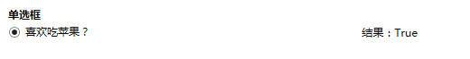

# 4 绑定以及绑定的各种使用场景

**一、绑定：**

主要包含元素绑定和非元素绑定两种。

**1 元素绑定，是绑定的最简单形式，源对象是WPF的元素，并且源对象的属性是依赖项属性。**

根据我们之前的知识，依赖项属性具有内置的更改通知支持，所以，当我们在源对象中改变依赖项属性的值时，会立即更新目标对象中的绑定属性。

以上篇的例子来重写，我们不用额外定义全局公开的属性来支持数据的显示。如下所示：

```xml
<StackPanel Orientation="Vertical" HorizontalAlignment="Left" >
    <TextBox x:Name="WelcomeText"
             Width="200"
             Margin="10,10,0,0">
    </TextBox>
    <TextBlock Text="{Binding ElementName=WelcomeText,
                      Path=Text,
                      StringFormat='Hello \{0\}'}"
               Margin="10,10,0,0">
    </TextBlock>
</StackPanel>
```


TextBlock 绑定了名称为 WelcomeText 的 TextBox 元素，并且，将 Path 指向它的 Text 属性，所以，它的值会跟着 WelcomeText 的值变化而变化。

**2 非元素类型绑定**&#x20;

**2.1 Source属性：绑定具体的数据对象：如系统信息跟我们定义的资源数据。**

在 Window 下定义的全局资源：

```xml
<Window.Resources>
    <SolidColorBrush x:Key="BorderBrush">Red</SolidColorBrush>
</Window.Resources>
```

应用到 View 视图中：

```xml
<StackPanel Margin="10,50,0,0" Orientation="Vertical" >
    <TextBlock
        Text="{Binding Source={x:Static SystemFonts.IconFontFamily},
                       Path=Source}">
    </TextBlock>
    <TextBlock
        Text="{Binding Source={StaticResource BorderBrush}}"
        Foreground="{Binding Source={StaticResource BorderBrush}}">
    </TextBlock>
</StackPanel>
```

结果：


**2.2 RelativeSource 属性：设置该属性 可以根据当前目标对象的相对关系指向源目标。比如，获取当前对象的父亲对象、兄弟对象或者自身的其它属性等一些数据。**

```xml
<StackPanel Margin="10,50,0,0" Orientation="Vertical" ToolTip="top">
    <StackPanel Orientation="Horizontal">
        <TextBlock Width="150" Text="获取自身宽度:"></TextBlock>
        <TextBlock Width="200"
            Text="{Binding Path=Width,
                           RelativeSource={RelativeSource Mode=Self}}">
        </TextBlock>
    </StackPanel>
    <StackPanel Orientation="Horizontal" ToolTip="parent">
        <TextBlock Width="150" Text="查找上一层ToolTip:"></TextBlock>  
        <TextBlock
            Text="{Binding Path=ToolTip,
                           RelativeSource={RelativeSource Mode=FindAncestor,AncestorType={x:Type StackPanel}}}">
        </TextBlock>
    </StackPanel>
    <StackPanel Orientation="Horizontal">
        <TextBlock Width="150" Text="查找上二层ToolTip:"></TextBlock>
        <TextBlock
            Text="{Binding Path=ToolTip,
                           RelativeSource={RelativeSource Mode=FindAncestor,AncestorType={x:Type StackPanel},AncestorLevel=2}}">
        </TextBlock>
    </StackPanel>
</StackPanel>
```

上面的代码还是很容易理解的，这里，在创建 RelativeSource 的时候，mode 模式有四种类型值：

| Mode成员名称        | 说明                                                                                  |
| --------------- | ----------------------------------------------------------------------------------- |
| FindAncestor    | 引用数据绑定元素的父链中的上级。 这可用于绑定到特定类型的上级或其子类。 若要指定 AncestorType 和/或 AncestorLevel，这就是应使用的模式。 |
| PreviousData    | 允许在当前显示的数据项列表中绑定上一个数据项（不是包含数据项的控件）。                                                 |
| Self            | 引用正在其上设置绑定的元素，并允许你将该元素的一个属性绑定到同一元素的其它属性上。                                           |
| TemplatedParent | 引用应用了模板的元素，其中，此模板中存在数据绑定元素。 这类似于设置 TemplateBindingExtension，且仅在 Binding 位于模板内部时适用。  |

注意：AncestorType 指得是查找的对象类型，AncestorLevel 代表搜索的层级的位置，如果是3，则忽略前两个发现的元素。

结果：


&#x20;**2.3 DataContext 属性：如果想将一个对象绑定到一个由多个元素组成的视图块或者复合元素中，用DataContext 会更好开发和维护。**

如下所示：

```xml
<StackPanel Orientation="Vertical" DataContext="UInfo" >
    <StackPanel Orientation="Horizontal" >
        <TextBlock Text="名称：" Width="100" ></TextBlock>
        <TextBox Text="{Binding Name}" Width="100" ></TextBox>
    </StackPanel>
    <StackPanel Orientation="Horizontal">
        <TextBlock Text="性别：" Width="100" ></TextBlock>
        <TextBox Text="{Binding Sex}" Width="100" ></TextBox>
    </StackPanel>
</StackPanel>
```

**二、绑定的各种使用场景：**

数据绑定既有普通控件的绑定应用，比如，下拉框、单选框、复选框、普通文本框 、日期框等；也有复杂控件的数据列表、用户控件信息的绑定应用，比如，ListBox，DataGrid，UserControl 等。

**1、下拉框：**

View 代码：

```xml
<StackPanel Margin="10,20,0,50">
    <TextBlock Text="下拉框"
               FontWeight="Bold"
               FontSize="12"
               Margin="0,5,0,5">
    </TextBlock>
    <DockPanel x:Name="Combbox" >  
        <StackPanel DockPanel.Dock="Left"
                    Width="240">
            <ComboBox Width="200"
                      HorizontalAlignment="Left"
                      ItemsSource="{Binding CombboxList}"
                      SelectedItem="{Binding CombboxItem}"
                      DisplayMemberPath="Text"
                      SelectedValuePath="Key">
            </ComboBox>
        </StackPanel>
        <StackPanel DockPanel.Dock="Right"
                    Width="240"
                    Orientation="Horizontal"
                    DataContext="{Binding CombboxItem}">
            <TextBlock Text="{Binding Key,StringFormat='结果：\{0\}'}"
                       Margin="0,0,15,0">
            </TextBlock>
            <TextBlock Text="{Binding Text}">
            </TextBlock>
        </StackPanel>
    </DockPanel>
</StackPanel>
```

Model 代码：

```csharp
public class ComplexInfoModel : ObservableObject
{
    private String key;
    /// <summary>
    /// Key值
    /// </summary>
    public String Key
    {
        get { return key; }
        set { key = value; RaisePropertyChanged(()=>Key); }
    }

    private String text;
    /// <summary>
    /// Text值
    /// </summary>
    public String Text
    {
        get { return text; }
        set { text = value; RaisePropertyChanged(()=>Text); }
    }
}
```

ViewModel 代码：

```csharp
#region 下拉框相关
    private ComplexInfoModel combboxItem;
    /// <summary>
    /// 下拉框选中信息
    /// </summary>
    public ComplexInfoModel CombboxItem
    {
        get { return combboxItem; }
        set
        {
            combboxItem = value;
            RaisePropertyChanged(() => CombboxItem);
        }
    }

    private List<ComplexInfoModel> combboxList;
    /// <summary>
    /// 下拉框列表
    /// </summary>
    public List<ComplexInfoModel> CombboxList
    {
        get { return combboxList; }
        set
        {
            combboxList = value;
            RaisePropertyChanged(()=>CombboxList);
        }
    }
#endregion
```

说明：CombboxItem 是一个全局的属性，作用在当前页面的 DataContext 数据上下文中，结果显示的内容指向下拉框中的选中值，达到共用一个数据的目的。&#x20;

这里有四个地方需要注意：ItemsSource：数据源；SelectedItem：选中的项；DisplayMemberPath：绑定时显示的所属值；SelectedValuePath：绑定时候key的所属值。&#x20;

结果：


**2、单选框**

```csharp
<StackPanel Margin="10,0,0,50">
    <TextBlock Text="单选框"
               FontWeight="Bold"
               FontSize="12"
               Margin="0,5,0,5">
    </TextBlock>
    <DockPanel x:Name="RadioButton" >
        <StackPanel DockPanel.Dock="Left"
                    Width="240">
            <RadioButton Content="{Binding SingleRadio}"
                         IsChecked="{Binding IsSingleRadioCheck}"
                         HorizontalAlignment="Right"
                         Width="240">
            </RadioButton>
        </StackPanel>
        <StackPanel DockPanel.Dock="Right"
                    Width="240"
                    Orientation="Horizontal">         
             <TextBlock Text="{Binding IsSingleRadioCheck,StringFormat='结果：\{0\}'}">
             </TextBlock>
        </StackPanel>
    </DockPanel>
</StackPanel>
```

说明：注意这边使用到了两个属性：SingleRadio 和 IsSingleRadioCheck，一个用于显示单选框内容，一个用于表示是否选中。

结果：



**3、组合单选框**

我们一般会用单选框做组合表示唯一选项，比如，性别包含男、女，但是只能选择一个。而更多的场景是包含多个选项，但是只能单选，这时候就需要做单选框组。

```csharp
<StackPanel Margin="10,0,0,50">
    <TextBlock Text="组合单选框"
               FontWeight="Bold"
               FontSize="12"
               Margin="0,5,0,5">
    </TextBlock>
    <DockPanel x:Name="GroupRadioButton" >
        <StackPanel DockPanel.Dock="Left" Width="240">
            <ItemsControl ItemsSource="{Binding RadioButtons}">
                <ItemsControl.ItemTemplate>
                    <DataTemplate>
                        <RadioButton Content="{Binding Content}"
                                     IsChecked="{Binding IsCheck}"
                                     GroupName="RadioButtons"
                                     Command="{Binding DataContext.RadioCheckCommand,RelativeSource={RelativeSource Mode=FindAncestor,AncestorType=ItemsControl}}">
                        </RadioButton>  
                    </DataTemplate>
                </ItemsControl.ItemTemplate>
            </ItemsControl>
        </StackPanel>
        <StackPanel DockPanel.Dock="Right"
                    Width="240"
                    Orientation="Horizontal">
            <TextBlock Text="{Binding RadioButton.Content,StringFormat='结果：\{0\}'}"></TextBlock>
        </StackPanel>
    </DockPanel>
</StackPanel>
```

这里使用了 ItemsControl，可以根据模板来定义内容，我们在模板中放置了我们需要用到的内容。这里需要注意的是：GroupName 用一样的，来代表这是一个单选控件组合。

这里有三个属性进行相关绑定：RadioButtons，单选框列表数据（循环绑定）；Content，单选框显示的内容；IsCheck，单选框的是否选中。&#x20;

结果：


**4、复选框，复选框与单选框的使用情况类似：**

```xml
<StackPanel Margin="10,0,0,50">
    <TextBlock Text="复合框"
               FontWeight="Bold"
               FontSize="12"
               Margin="0,5,0,5">
    </TextBlock>
    <DockPanel x:Name="GroupCheckButton">
        <StackPanel DockPanel.Dock="Left" Width="240">
            <ItemsControl x:Name="cbt"
                          ItemsSource="{Binding CheckButtons}">
                <ItemsControl.ItemTemplate>
                    <DataTemplate>
                        <CheckBox Content="{Binding Content}" IsChecked="{Binding IsCheck}" Command="{Binding DataContext.CheckCommand,RelativeSource={RelativeSource Mode=FindAncestor,AncestorType=ItemsControl}}"/>
                    </DataTemplate>
                </ItemsControl.ItemTemplate>
            </ItemsControl>
        </StackPanel>
        <StackPanel DockPanel.Dock="Right" Width="240"
                    Orientation="Horizontal">
            <TextBlock Text="{Binding CheckInfo,StringFormat='结果：\{0\}'}" ></TextBlock>
        </StackPanel>
    </DockPanel>
</StackPanel>
```

结果：


**5、树形控件**

View 代码：

```xml
<StackPanel Margin="10,0,0,50">
    <TextBlock Text="树" FontWeight="Bold" FontSize="12" Margin="0,5,0,5" ></TextBlock>
    <DockPanel x:Name="TreeButton" >
        <StackPanel DockPanel.Dock="Left" Width="240">
            <TreeView x:Name="tree"
                      ItemsSource="{Binding TreeInfo}"
                      BorderThickness="0">
                <TreeView.ItemTemplate>
                    <HierarchicalDataTemplate ItemsSource="{Binding Children}">
                        <TextBlock Text="{Binding NodeName}"/>
                    </HierarchicalDataTemplate>
                </TreeView.ItemTemplate>
            </TreeView>
        </StackPanel>
        <StackPanel DockPanel.Dock="Right" Width="240"
                    Orientation="Horizontal"
                    DataContext="{Binding SelectedItem,ElementName=tree}">
            <TextBlock Text="结果："/>
            <TextBlock Text="{Binding NodeID,StringFormat='NodeID：\{0\}'}" Margin="0,0,20,0" />
            <TextBlock Text="{Binding NodeName,StringFormat='NodeName：\{0\}'}"/>
        </StackPanel>  
    </DockPanel>
</StackPanel>
```

Model 代码：

```csharp
public class TreeNodeModel : ObservableObject
{
    public string NodeID { get; set; }
    public string NodeName { get; set; }
    public List<TreeNodeModel> Children { get; set; }
}
```

ViewModel 代码：

```csharp
#region 树控件

    private List<TreeNodeModel> treeInfo;
    /// <summary>
    /// 树控件数据信息
    /// </summary>
    public List<TreeNodeModel> TreeInfo
    {
        get { return treeInfo; }
        set
        {
            treeInfo = value;
            RaisePropertyChanged(()=>TreeInfo);
        }
    }
#endregion
```

结果：


**6、ListBox**

当我们需要用到循环的列表内容，并且模板化程度高的时候，建议使用 ListBox 来做绑定。

View 代码：

```csharp
<StackPanel Margin="10,0,0,50" Orientation="Vertical" >
    <TextBlock Text="ListBox模板" FontWeight="Bold" FontSize="12" Margin="0,5,0,5" ></TextBlock>
        <DockPanel >
            <StackPanel HorizontalAlignment="Left" DockPanel.Dock="Left" >
                <ListBox x:Name="lb" ItemsSource="{Binding ListBoxData}" Width="500" BorderThickness="0" >
                    <ListBox.ItemsPanel>
                        <ItemsPanelTemplate>
                            <WrapPanel Width="{Binding ActualWidth,RelativeSource={RelativeSource AncestorType={x:Type ListBox}}}"/>
                        </ItemsPanelTemplate>
                    </ListBox.ItemsPanel>

                    <ListBox.ItemTemplate>
                        <DataTemplate>
                            <StackPanel>
                                <Image Source="{Binding Img}" Width="96" Height="96"/>
                                <TextBlock HorizontalAlignment="Center" Text="{Binding Info}"/>
                            </StackPanel>
                        </DataTemplate>
                    </ListBox.ItemTemplate>
                </ListBox>
            </StackPanel>
            <StackPanel DockPanel.Dock="Right" DataContext="{Binding SelectedItem,ElementName=lb}" Margin="15" Orientation="Vertical" >
                <TextBlock Text="{Binding Info,StringFormat='选中：\{0\}'}" ></TextBlock>
            </StackPanel>
        </DockPanel>
</StackPanel>
```

ViewModel 代码：

```csharp
#region ListBox 模板
    private IEnumerable listBoxData;

    /// <summary>
    /// ListBox数据模板
    /// </summary>
    public IEnumerable ListBoxData
    {
        get { return listBoxData; }
        set
        {
            listBoxData = value;
            RaisePropertyChanged(()=>ListBoxData); 
        }
    }
#endregion
```

初始数据：

```csharp
private void InitListBoxList()
{
    ListBoxData = new ObservableCollection<dynamic>()
    {
        new { Img="/MVVMLightDemo;component/Images/1.jpg",Info="樱桃" },
        new { Img="/MVVMLightDemo;component/Images/2.jpg",Info="葡萄" },
        new { Img="/MVVMLightDemo;component/Images/3.jpg",Info="苹果" },
        new { Img="/MVVMLightDemo;component/Images/4.jpg",Info="猕猴桃" },
        new { Img="/MVVMLightDemo;component/Images/5.jpg",Info="柠檬" },
    };
}
```

结果：


**7、用户控件的集合绑定：**

ListBox 的列表绑定远远不能满足我们实际工作中的需求，出于对灵活性、复用性以及代码精简层面的考虑，需要保证循环列表中的单个元素是独立的元素片段，类似Web中的局部视图。 这时候，使用用户控件会好很多。

我们先写一个用户控件，分别设置了它的样式、绑定的属性值，如下所示：

```xml
<UserControl x:Class="MVVMLightDemo.Content.FruitInfoView"
    xmlns="http://schemas.microsoft.com/winfx/2006/xaml/presentation"
    xmlns:x="http://schemas.microsoft.com/winfx/2006/xaml"
    xmlns:mc="http://schemas.openxmlformats.org/markup-compatibility/2006"
    xmlns:d="http://schemas.microsoft.com/expression/blend/2008" 
    mc:Ignorable="d"
    d:DesignHeight="300" d:DesignWidth="300">
<Grid>
    <Grid.Resources>
        <Style TargetType="{x:Type StackPanel}">
            <Style.Triggers>
                <Trigger Property="IsMouseOver" Value="True">
                    <Setter Property="RenderTransform">
                        <Setter.Value>
                            <RotateTransform Angle="10">
                            </RotateTransform>
                        </Setter.Value>
                    </Setter>
                    <Setter Property="Background" Value="#3B9CFB"/>
                </Trigger>
            </Style.Triggers>
        </Style>
    </Grid.Resources>
    <StackPanel Orientation="Vertical" Margin="10">
        <Image Source="{Binding Img}" Width="96" Height="96"/>
        <TextBlock HorizontalAlignment="Center" Text="{Binding Info}"/>
    </StackPanel>
</Grid>
</UserControl>
```

&#x20;在目标 View 视图页面注册并使用：

```xml
xmlns:Content="clr-namespace:MVVMLightDemo.Content"
```

```xml
<StackPanel Margin="10,0,0,50" Orientation="Vertical">
    <TextBlock Text="用户控件模板列表"
               FontWeight="Bold"
               FontSize="12"
               Margin="0,5,0,5"></TextBlock>
    <StackPanel HorizontalAlignment="Left" Width="500">
        <ItemsControl ItemsSource="{Binding FiList}"
                      HorizontalAlignment="Left">
            <ItemsControl.ItemTemplate>
                <DataTemplate>
                    <Content:FruitInfoView/>
                </DataTemplate>  
            </ItemsControl.ItemTemplate>

            <!-- 面板显示模板 -->
            <ItemsControl.ItemsPanel>
                <ItemsPanelTemplate>
                    <WrapPanel Orientation="Horizontal"></WrapPanel>
                </ItemsPanelTemplate>
            </ItemsControl.ItemsPanel>
        </ItemsControl>
    </StackPanel>
</StackPanel>
```

结果：


后记：这篇更确切的说是绑定的相关知识，只是应用了MVVM模式来实现。

工作太忙了，写的太慢，其实后面几篇都已经成稿了，一直放在Note里面等待认真检查，品质太差怕误导其他开发人员。
